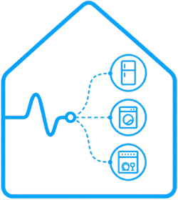

# NILM For Home Assistant

  

Estimate appliance usage from a single mains power sensor.

Use NILM to train appliance models from Home Assistant history, preview historical disaggregation, and publish live estimated entities for dashboards and automations without installing a dedicated meter on every device.

This repository contains two Home Assistant apps that work together:

- `NILM` (inference app)
- `NILM Training Server` (training app)

NILM estimates appliance behavior from one aggregate mains power sensor. It provides useful estimation, not direct per-appliance metering.

## Why NILM

- Estimate appliance usage from one mains sensor instead of installing a dedicated meter on every device.
- Train appliance models directly from Home Assistant recorder history.
- Analyze estimated appliance share, consumption, and activity over time.
- Publish estimated appliance entities for dashboards, automations, and energy workflows.

## Before You Begin

- A working Home Assistant OS installation.
- A mains power sensor already available in Home Assistant.
- Recorder history for the time range you want to train.
- Both apps installed: `NILM` and `NILM Training Server`.
- At least 4 GB RAM for Home Assistant and the NILM apps.

## What Each App Does

### NILM

- Monitors one mains power sensor in Home Assistant.
- Runs live NILM inference.
- Publishes estimated appliance entities (`power` and `on/off`).
- Provides UI for setup, preview, and training job preparation.

### NILM Training Server

- Receives prepared training jobs from NILM.
- Runs model training in the background.
- Returns trained embeddings and learned thresholds back to NILM.

## Quick Start

1. Open Home Assistant.
2. Go to `Settings` > `Apps` > `Install App`.
3. Add this repository: `https://github.com/lgarciamarrero92/ha-nilm`.
4. Install `NILM`.
5. Install `NILM Training Server`.
6. Start `NILM Training Server` first.
7. Start `NILM`.
8. Open the `NILM` interface.
9. Select and save your mains sensor.
10. Open the Training interface and confirm the training server is ready.
11. Train appliance models, validate in dashboard preview, then enable live publishing.

## Why Two Apps

Training and live inference are split by design:

- `NILM` stays lightweight and responsive for continuous runtime.
- `NILM Training Server` handles heavier ML training workloads.
- `NILM Training Server` is only needed when you want to train or retrain models. After your models are trained and enabled in `NILM`, you can stop the training app and keep only `NILM` running for live inference.

## Why NILM Requests Supervisor Manager Role

The `NILM` app requests the Home Assistant Supervisor `manager` role so it can query the Supervisor API and autodetect the `NILM Training Server` add-on for you.

This is used to:

- Enumerate installed add-ons.
- Detect whether `NILM Training Server` is installed and started.
- Read its internal add-on hostname.
- Build the internal training server URL automatically so you do not have to enter it manually in the common case.

## Main Workflow

1. In `NILM` Training, choose manual interval labeling or sensor-based labeling.
2. Select a mains range that you can label completely.
3. Prepare and send the training job to `NILM Training Server`.
4. Wait for job completion in the Training Jobs table.
5. Validate predictions in the NILM Dashboard.
6. Enable live publishing for selected models.

Notes:
- Training range is limited to the previous 7 days.
- Live entities update approximately every 8 seconds.

## Documentation

Main end-user documentation:

- https://ha-nilm.bigwicho.com/

## License

This project is licensed under the Apache License 2.0. See [LICENSE](LICENSE) for details.
